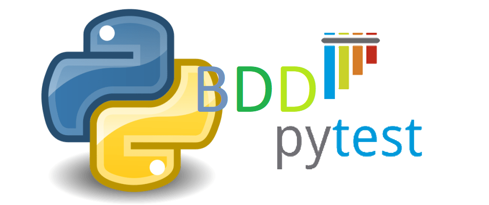

# Interview for MobileAppTesting
This is a framework I created for an interview to automate some scenarios. I am using Pytest-BDD, Appium, and POM Pattern.

## Steps to Install and Set Up the Project on Your Laptop

1. Install pipenv to manage your virtual environment.
2. Navigate to your project directory (if you're not already there).<br>
Once you're inside the project folder where the Pipfile and/or Pipfile.lock is located, run:
```bash
pipenv install
```
3. Activate your virtual environment.<br>
After the installation is complete, activate the virtual environment by running:
```bash
pipenv shell
```

You can watch the video **BreeMobileApp_Automation_compressed.mp4** to see how it works.

or with this link: <a href="https://github.com/rormenol/MobileTesting_PytestBDD_POM/blob/main/MobileApp_PytestBDD_Automation.mp4">Click to watch this demo</a>

or playing this: 
[](https://youtu.be/9yzkFZmIGMg)


